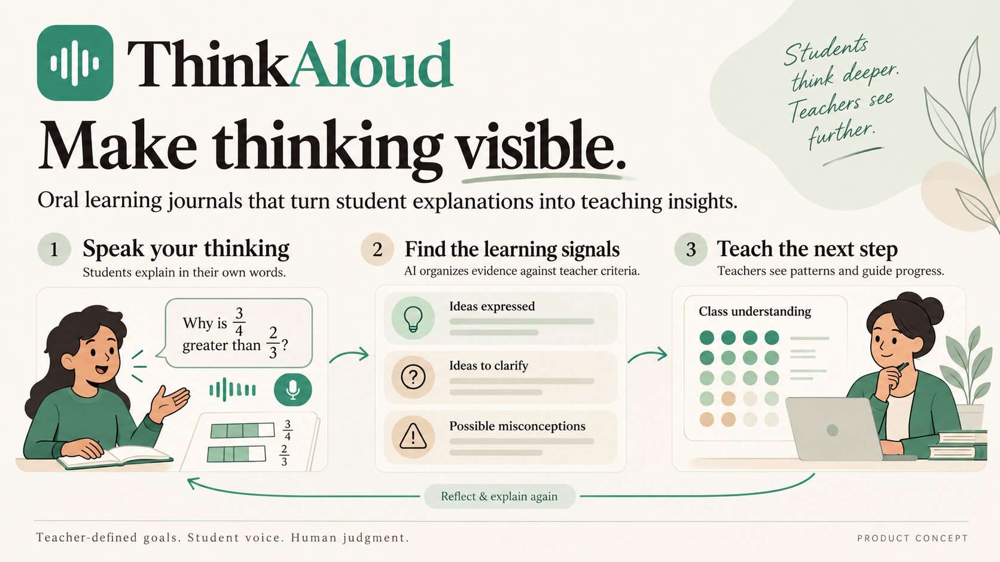

# ThinkAloud

**Oral Journal helps teachers hear how students think, not only whether they reached the right answer.**

Teachers define a question, success criteria, and common misconceptions. Students explain a concept in their own words through a short oral knowledge journal. The product then organizes evidence from those explanations so students know what to clarify and teachers can see the class-wide ideas that need attention.

## The problem

Written answers and multiple-choice quizzes can reveal whether a student selected the right answer, but they often hide *how* that student is reasoning. It is difficult for one teacher to listen to every learner's explanation, identify misconceptions, and turn those observations into a useful next lesson.

Oral Journal is a formative-learning tool, not an automated oral exam. It supports the teacher's professional judgment by making student explanations easier to review and compare against teacher-defined standards.

## How it works

1. **A teacher creates an oral task.** They provide a question, the knowledge points students should explain, and common misconceptions to watch for.
2. **A student records a first explanation.** A short spoken response is transcribed; a text-entry fallback can be used when recording is unavailable.
3. **AI organizes the evidence.** Using only the teacher's criteria, it identifies ideas the student expressed, ideas that were not yet expressed, and possible misconceptions or unclear reasoning.
4. **The student explains again.** The follow-up prompt focuses on a specific missing point, rather than asking the student to repeat everything.
5. **The teacher sees the learning pattern.** A class understanding map aggregates secure knowledge points, ideas to strengthen, and common misconceptions, enabling a targeted next activity.

## Demo scenario

The current prototype uses a Grade 5 mathematics task:

> Why is `3/4` greater than `2/3`?

The teacher's success criteria include:

- Recognizing that fractions must refer to the same whole.
- Explaining the meaning of numerator and denominator.
- Finding common denominators.
- Giving both a conclusion and a reason.

The dashboard highlights a typical misconception: **“A larger denominator means a larger fraction.”** It then suggests a short classroom activity based on equally sized pizzas.

## Current prototype

The first prototype is a responsive, English-language teacher dashboard. It includes:

- A class overview and active-task summary.
- A class understanding map organized by knowledge point.
- Counts for students who are secure or need further explanation.
- Common misconceptions and a teacher-facing next-step suggestion.
- A list of journals that need attention.
- A task-creation modal with editable question and knowledge-point criteria.
- A sample “5-minute review activity” interaction.

The dashboard currently uses static demo data. It does **not** yet record student audio, transcribe speech, call an AI model, persist data, authenticate users, or send notifications.

## Product principles

- **Teacher-defined criteria come first.** AI should organize evidence against the teacher's goals; it should not silently invent a rubric.
- **Explanation is more important than fluency.** Accent, confidence, or speaking pace should not be treated as proof of understanding.
- **AI assists; teachers decide.** Teachers can review uncertain records and retain final judgment.
- **Feedback is constructive.** The product should name ideas to clarify, not label students as failures.
- **Student data deserves care.** Audio, transcripts, and AI processing must be transparent and handled with appropriate consent and privacy protections.

## Planned next steps

1. Build the student journal page with audio recording and a transcript/text fallback.
2. Add a server-side analysis endpoint that returns structured evidence:

   ```ts
   {
     mentioned: string[];
     missing: string[];
     misconceptions: string[];
     feedback: string;
     followUpPrompt: string;
   }
   ```

3. Compare a student's first and second explanations by knowledge point.
4. Replace static dashboard values with aggregated class data.
5. Add a teacher review queue for low-confidence or incomplete transcripts.

Future versions may introduce spaced follow-up prompts based on specific missing knowledge points. Those reminders should be optional and supportive, never punitive.

## Run locally

Run `npm start` with Node.js installed, then visit http://localhost:8000.
The included server serves the login and both workspaces, plus `/api/health` and `/api/analyze`.
To enable DeepSeek analysis, copy `.env.example` to `.env` and set your own key. Without a key, the student page uses its existing offline keyword mode.

## Demo login and navigation

- `teacher@oraljournal.demo` opens the latest teacher dashboard at `teacher.html`.
- `student@oraljournal.demo` opens the full student oral journal at `student.html`.
- The login page is `index.html`. Demo buttons fill an email; Continue opens its workspace.
- Unknown emails show a message. Add approved demo emails to `OralJournal.accounts` in `session.js`.
- Refresh retains the current tab’s session. Sign out returns to login. Direct workspace visits require a demo session, and a mismatched role returns to its own workspace.
- These are client-side demo navigation checks, not real authentication or server authorization.
- Student journals still use the upstream device-local storage workflow; the teacher dashboard still displays demo data. This integration connects login to both workspaces; it does not add student submission synchronization to the teacher dashboard.

## Project status

This is an early hackathon prototype. The visual dashboard and interactions demonstrate the product direction; the AI, voice, persistence, and classroom workflows described above are planned implementation work, not claims about currently available functionality.

## Publishing teacher assignments

Teachers can create a question and one knowledge point per line, then select **Publish oral task**. All saved assignments appear once in the teacher **Oral tasks** grid and in the student task list. Student pages poll `/api/tasks` every five seconds and refresh on focus without replacing an active answer. All demo students connected to the same server receive these assignments.

Tasks persist in `data/tasks.json` (ignored by Git). Keep this directory when restarting or redeploying the server. GET/POST `/api/tasks` provide the shared task store; invalid or empty tasks are rejected. This remains a demo API without server-side user authentication or class-specific assignment permissions. Student submission synchronization is described below.


## Student submissions → teacher

Click **Submit explanation** in the student workspace. Submitted attempts upload automatically to the same Node server; drafts remain in browser storage (and the optional student cloud store). Open **Student submissions** as the teacher to see answers, timestamps, each attempt, idea coverage, and feedback. Filter by task or refresh manually; the list also polls every five seconds and preserves expanded answers.

- The server saves submissions in `data/submissions.json` using atomic file replacement. Preserve `data/` across server restarts and deployments. This file store supports one Node server process.
- Attempts use stable IDs for idempotent retry. Feedback updates a pending attempt without creating a duplicate; a late pending request cannot overwrite completed feedback.
- Failed uploads retry every five seconds, on reconnect, and on focus. Reopening the student page retries persisted attempts. Only submitted answers are sent to the teacher API.
- This follows the existing single-classroom **demo identity** model. The API has no trusted authentication or class permissions, and feedback is client-provided. Production use needs authenticated students/teachers and classroom authorization. The existing teacher overview and roster still contain sample data; live answers are under **Student submissions**.
- Shared teacher delivery uses this server, independently of optional Supabase student backup. Different devices must connect to the same server address.

Run `node --test tests/*.test.js` to verify storage, duplicate handling, late feedback, draft exclusion, and upload recovery. Start this branch preview with `PORT=8016 node server.js`; without an AI key the app labels feedback as an offline keyword check.
## Demo login

Open the root URL to sign in. `teacher@oraljournal.demo` opens `teacher.html`; `student@oraljournal.demo` opens `student.html`. The demo buttons fill an email; Continue opens its workspace. Unknown emails show an error. Add demo accounts in `session.js`.

Sessions last for the browser tab and survive refresh. Both workspaces show the current email and a Sign out button, including on mobile. Direct visits without a session return to login; mismatched roles return to their own workspace. These client-side checks are demo navigation only, not authentication or server authorization.


## Voice-only student workspace

Students use one **My tasks** list. A task with prior submissions has a **Journal** link beneath it, opening that task's submission history. The answer editor has been removed. Press **Record**, speak, then **Stop recording** and **Submit explanation**. The recording panel displays microphone-driven waveform bars and elapsed time, with no live transcript. Transcription stays in memory and saved voice drafts for analysis and teacher delivery; submitted text remains available in journal history. This uses the existing speech recognition pipeline and does not store an audio file.

Submission stays disabled until recognition finishes and enough speech is captured. Navigating away releases microphone resources. Older typed drafts are not restored into voice-only responses. Microphone permission and speech recognition support are required; unsupported browsers show instructions instead of a typing fallback. Waveform implementation follows the [MDN analyser documentation](https://developer.mozilla.org/en-US/docs/Web/API/AnalyserNode/getByteTimeDomainData), and stop waits for the final speech result described in [SpeechRecognition.stop](https://developer.mozilla.org/en-US/docs/Web/API/SpeechRecognition/stop).
